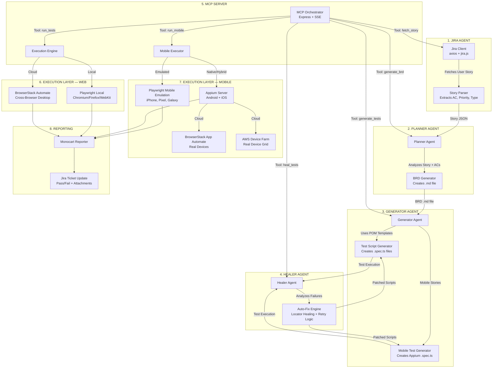

# AI-Powered Multi-Agent Test Automation Framework

Transform the existing Playwright framework into an enterprise-grade, AI-driven multi-agent system that automatically reads Jira stories, generates BRDs, creates test scripts (Web, Mobile & GraphQL), self-heals broken tests, optimizes LLM tokens via **Distributed Redis Caching**, monitors agent telemetry via **LangSmith**, and executes on local & cloud — all orchestrated through an **MCP server**.

---

## High-Level Architecture



---

## Technical Stack & Tools
- **UI Automation**: Playwright + TypeScript + Page Object Model (POM)
- **Mobile Native Automation**: WebdriverIO + Appium + Screen Object Model (SOM)
- **API Automation**: Playwright APIRequestContext
- **AI Agents**: OpenAI GPT-4o / Google Gemini via MCP
- **Orchestration**: Model Context Protocol (MCP) Server
- **Load Testing**: Gatling (TypeScript SDK)
- **Cloud Execution**: BrowserStack (Web/App Automate) & AWS Device Farm
- **Reporting**: Monocart Reporter & Healing Reports

---

## Execution Guide

### 1. Run Pipeline Orhestrator (End-to-End)
Runs the complete flow: Jira → Planner → Generator → Execute → Heal
```bash
npx ts-node agents/pipeline.ts --issue PROJ-123
```
Add `--dry-run` to see what would happen without actually executing tests.

### 2. Start the MCP Server
Allows any MCP-compatible AI client to orchestrate the pipeline via tools.
```bash
npm run mcp:start
```

### 3. Run Web Tests (Playwright)
```bash
npm run test                   # Local Chromium
npm run test:mobile-web        # Playwright mobile emulation
npm run test:browserstack      # BrowserStack cross-browser
```

### 4. Run Mobile Native Tests (Appium)
```bash
npm run appium:start           # Start Appium server first
npm run test:mobile:android    # Local Android emulator
npm run test:mobile:ios        # Local iOS simulator
npm run test:mobile:browserstack # BrowserStack App Automate
```

---

## Configuration & Secrets
Copy `.env.example` to `.env` and fill in your values for Jira, OpenAI/Gemini, BrowserStack, and AWS.

> **Note:** Do NOT commit your `.env` file!

---

## Old Setup Notes

- **UI Automation**: Playwright tests are in `tests/ui/`
- **API Automation**: Playwright API tests are in `tests/api/`
- **Load Testing**: Gatling load tests are in `load-tests/`
- **Legacy Run**: `npx playwright test` still works!
