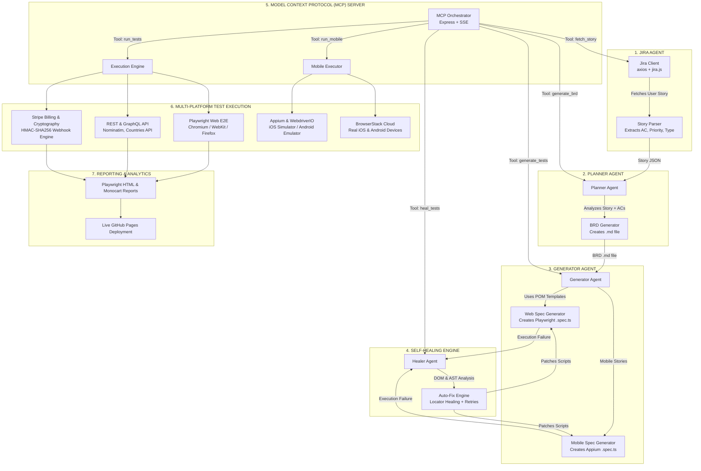

# 🚀 Enterprise AI-Powered Multi-Agent Test Automation Platform

[](https://github.com/abhirise1981/ai-test-automation-platform/actions/workflows/playwright.yml)
[](https://abhirise1981.github.io/ai-test-automation-platform/)
[](https://www.typescriptlang.org/)
[](https://playwright.dev/)
[](https://appium.io/)
[](https://gatling.io/)

A state-of-the-art, enterprise-grade test automation platform unifying **Web UI**, **Native Mobile (iOS/Android)**, **REST/GraphQL APIs**, **Stripe Billing & Webhook Cryptographic Security**, **High-Concurrency Load Testing**, and an **Autonomous Multi-Agent AI Layer** with self-healing locators.

👉 **[📊 View Live Interactive Test Dashboard](https://abhirise1981.github.io/ai-test-automation-platform/)**

---

## 🏛️ High-Level System Architecture



---

## 💎 Framework Modules & Key Capabilities

| Layer | Technologies | Highlights & Test Coverage |
| :--- | :--- | :--- |
| 🌐 **Web UI E2E** | Playwright, TypeScript, Page Object Model (POM) | Full customer journeys: 2-step Signup/Login, Product Discovery, Cart management, and Checkout order placement. Resilient against ad intercepts and dynamic modal animations. |
| 💳 **Stripe & Billing** | TypeScript, HMAC-SHA256, Form-URL-Encoded REST | End-to-end SaaS subscription lifecycle (Starter, Pro, Enterprise), PaymentIntents, partial/full refunds, webhook replay protection, and cryptographic signature validation. |
| 📱 **Native Mobile** | Appium, WebdriverIO, Screen Object Model (SOM) | Cross-platform automation on iOS Simulator and Android Emulator. Touch gestures, scrolls, and device orientation handling. |
| 📱 **Mobile-Web** | Playwright Device Descriptors | Mobile viewport emulation (iPhone 14, Pixel 7) testing responsive hamburger navigation and touch tap targets. |
| 🔌 **REST & GraphQL** | Playwright APIRequestContext, Service Object Model | Full CRUD assertions (GET, POST, PUT, PATCH, DELETE), Basic Auth security boundaries, reverse geocoding, and GraphQL query resolution. |
| ⚡ **Performance** | Gatling TypeScript SDK, P.S.I.A. Architecture | Concurrency load tests, token correlation, cookie header management, and response time SLA assertions. |
| 🤖 **AI Self-Healing** | LangChain, LLM Cache, AST Repair | Autonomous test generation from Jira BRDs + self-healing locator engine that heals broken UI selectors at runtime. |

---

## 🚀 Quickstart & Execution Guide

### 1. Installation
```bash
# Clone the repository
git clone https://github.com/abhirise1981/ai-test-automation-platform.git
cd ai-test-automation-platform

# Install dependencies
npm install

# Install Playwright browser binaries
npx playwright install --with-deps
```

### 2. Run Test Suites
```bash
# Run all automated tests (UI, REST, GraphQL, Stripe)
npm run test

# Run UI E2E tests only
npx playwright test tests/ui/

# Run Stripe Billing & Webhook tests only
npx playwright test tests/api/stripe.spec.ts

# Run REST & GraphQL API tests only
npx playwright test tests/api/location.spec.ts tests/api/graphql.spec.ts

# Run Mobile-Web responsive tests
npm run test:mobile-web
```

### 3. Native Mobile Automation (Appium)
```bash
# Start Appium Server
npm run appium:start

# Run Android Native Tests
npm run test:mobile:android

# Run iOS Native Tests
npm run test:mobile:ios
```

### 4. Gatling Performance & Load Testing
```bash
# Run Gatling TypeScript Load Tests
npx gatling run --typescript --sources-folder load-tests --simulation ecommerce
```

### 5. AI Multi-Agent Pipeline & MCP Server
```bash
# Run the autonomous Jira-to-Test agent pipeline
npx ts-node agents/pipeline.ts --issue PROJ-123

# Start the MCP Tool Server for AI assistants
npm run mcp:start
```

---

## 📊 Reports & CI/CD Pipelines

* **Dual CI/CD Integration**:
  * **GitHub Actions**: Automated regression on every push/PR with instant artifact publishing.
  * **GitLab CI**: Fully configured `.gitlab-ci.yml` multi-stage pipeline.
* **Interactive Live Reporting**:
  * View real-time test execution graphs, metrics, and video traces at **[https://abhirise1981.github.io/ai-test-automation-platform/](https://abhirise1981.github.io/ai-test-automation-platform/)**.
* **Local Report Viewer**:
  ```bash
  npx playwright show-report
  # or Monocart Executive Dashboard:
  npx monocart show-report test-results/report.html
  ```

---

## 📄 License
Distributed under the MIT License. Developed for enterprise-grade test automation and architectural evaluations.
